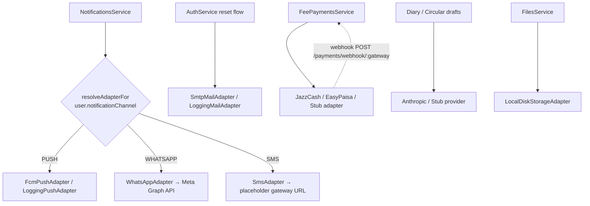

# Integration Architecture

> **Status:** CURRENT · **Verified:** 2026-09-20 against `main@15362b7` · **Owner:** Engineering Lead
> Architecture only. Per-integration operations (configuration, credentials, failure handling, verification status): [`docs/operations/INTEGRATIONS.md`](../operations/INTEGRATIONS.md).

Every external dependency sits behind an interface with an environment-selected implementation ([BACKEND.md](BACKEND.md), [ADR-0004](../decisions/ADR-0004-adapter-pattern.md)).

Inbound: only the payment webhook is public (signature-verified). Outbound calls use provider SDKs or `fetch`; there is no retry, queue or dead-letter mechanism (notification failures are logged and swallowed, `notifications.service.ts:72`).

## Decided direction (owner, 2026-09-20; not yet implemented)
Integrations stay adapter-based and provider-agnostic; production adds an S3-compatible storage adapter, provider abstractions for e-mail and SMS, feature-flagged gateways/WhatsApp/AI, and Sentry. Details and work items: [operations/INTEGRATIONS](../operations/INTEGRATIONS.md), [BACKLOG](../product/requirements/BACKLOG.md).
