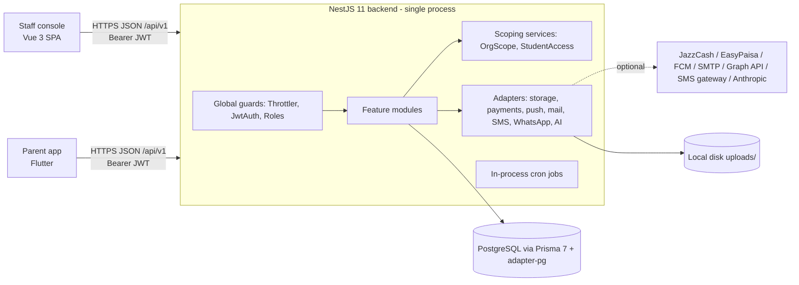

# System Overview

> **Status:** CURRENT · **Verified:** 2026-09-20 against `main@15362b7` · **Sources:** `backend/src/app.module.ts`, `backend/prisma/schema.prisma`, `staff-console/src/main.ts`, `parent-app/lib/main.dart`, `.github/workflows/ci.yml` · **Owner:** Engineering Lead

## Shape

One backend process, one PostgreSQL database, two clients. There is no API gateway, queue, cache, worker process or object store (`backend/package.json`, `src/`: only `@nestjs/schedule` in-process jobs and `LocalDiskStorageAdapter`).

## Request path (backend)
1. Global `ThrottlerGuard` (`app.module.ts:92`) → 2. `JwtAuthGuard` (skips `@Public()` routes) → 3. `RolesGuard` (`@Roles()`; `auth/auth.module.ts:49-50`) → 4. `ValidationPipe({whitelist, transform})` (`main.ts:16`) on DTOs → 5. controller → service, which applies **object-level scoping** (`OrgScopeService` for school/campus; `StudentAccessService` for student/section/class and teacher assignment) → 6. Prisma.
No global exception filter, interceptor or request logger is registered (no `APP_FILTER`/`APP_INTERCEPTOR` in `src/`); errors use Nest defaults.

## Data architecture (summary; details in [`docs/database/`](../database/DATA-MODEL.md))
57 models across identity, org (School → Campus → Class(+session) → Section), people, enrollment/promotion history, academics, communication, finance, files/audit. Scoping columns: `User.schoolId/campusId`, `Campus.schoolId`, `Class.campusId`. `AcademicSession`, `Subject`, `FeeStructure`, `Term` have no school column ([TENANCY](../database/TENANCY.md)).

## Security architecture (summary; details in [`docs/security/`](../security/SECURITY-OVERVIEW.md))
Argon2 password hashing; short-lived JWT access token + hashed, rotating refresh tokens; server-side role guards; service-level tenant scoping; DTO validation; per-route and global throttling; CORS allow-list; secrets via env with fail-fast for partially configured providers. Gaps: no security headers, staff console keeps tokens in `localStorage`, `NODE_ENV` defaults to "development" when unset.

## Build and CI
GitHub Actions (`ci.yml`): backend (Postgres 16 service, `prisma migrate deploy`, lint [non-blocking], build, unit, e2e), staff-console (lint, test, build), parent-app (`flutter analyze`, `flutter test`). No deploy or publish job.

## Deployment topology
**None defined in the repository.** See [`docs/operations/DEPLOYMENT.md`](../operations/DEPLOYMENT.md).

## Design direction note
The owner intends a future multi-tenant SaaS. The current design is one database with school/campus scoping in application code and needs its own audit before any refactor ([ADR-0006](../decisions/ADR-0006-tenancy-by-scoping-columns.md)).
