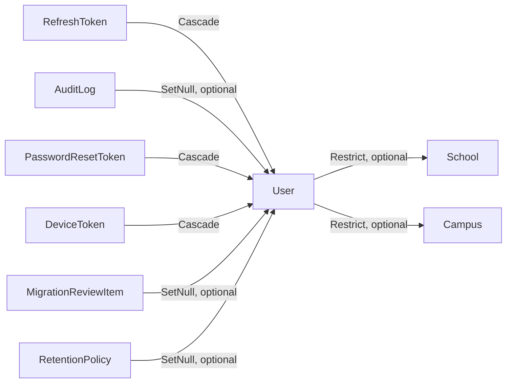
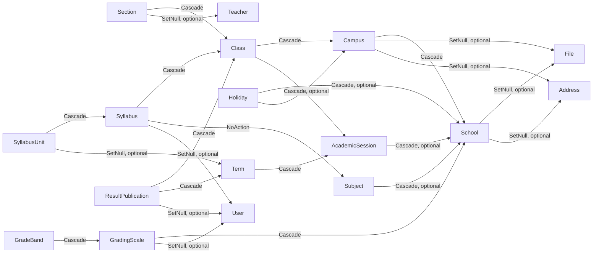
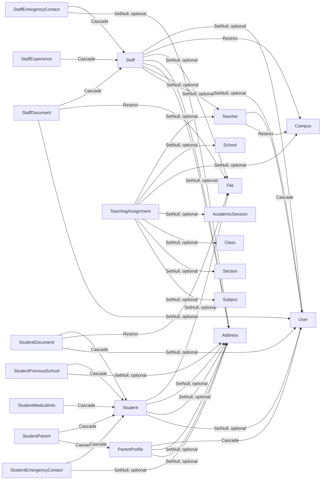
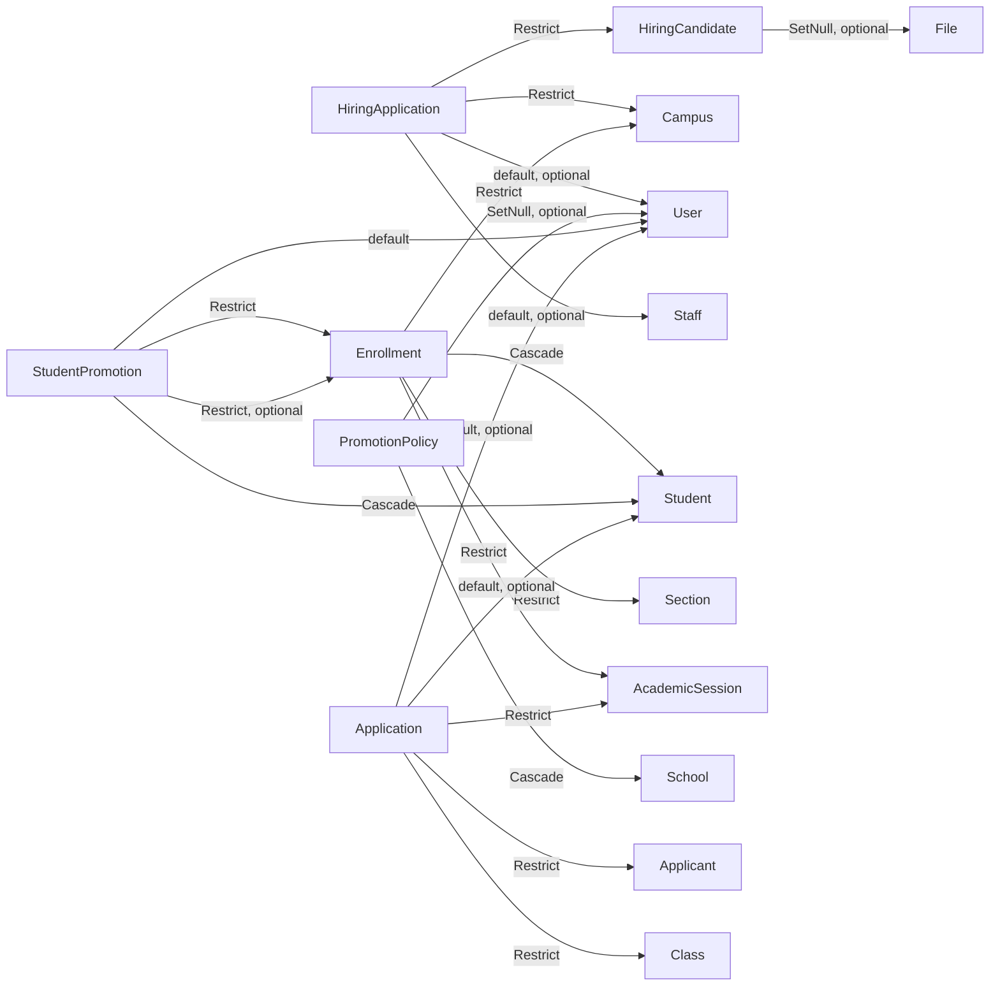
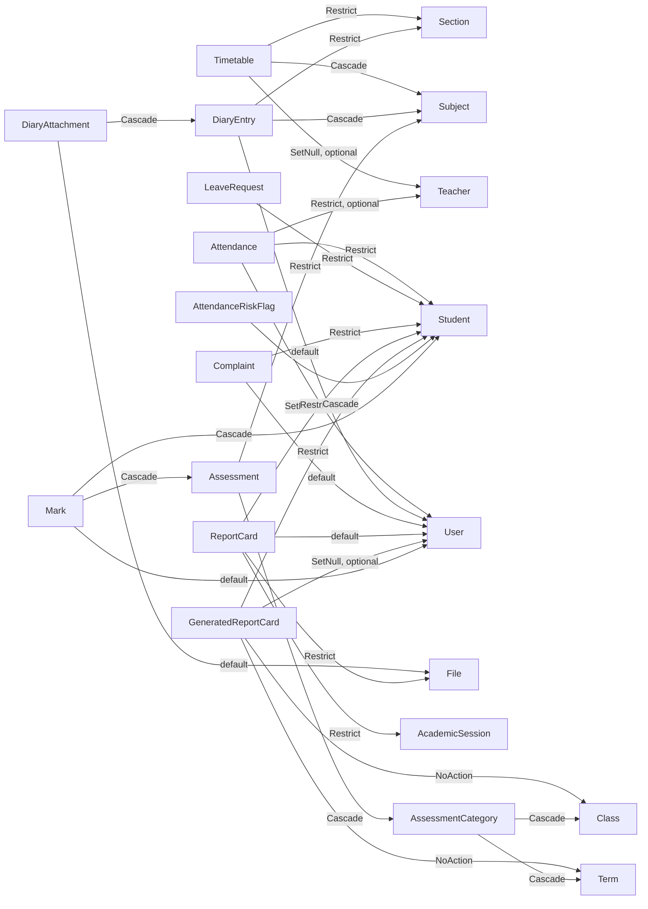
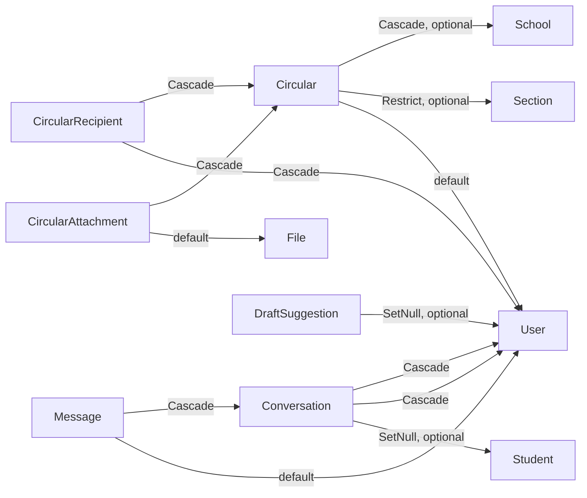
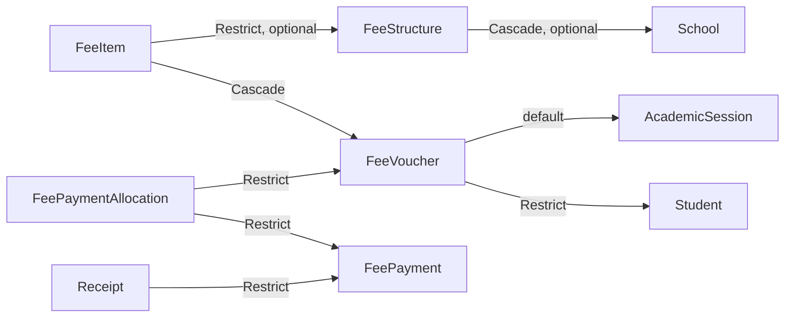

# Entity Relationships

> **Status:** CURRENT · **Generated** by `scripts/docs/generate.mjs` (BL-66) from `schema.prisma` (edges: child → parent for every owning-side `@relation`) — do not edit by hand · **Owner:** Engineering Lead
> Edge label = `onDelete` (`default` = Prisma default); `optional` = nullable foreign key. Cross-domain parents appear as plain nodes.

## Identity

## Organization

## People

## Enrollment & admissions & hiring

## Academics

## Communication

## Finance & files

